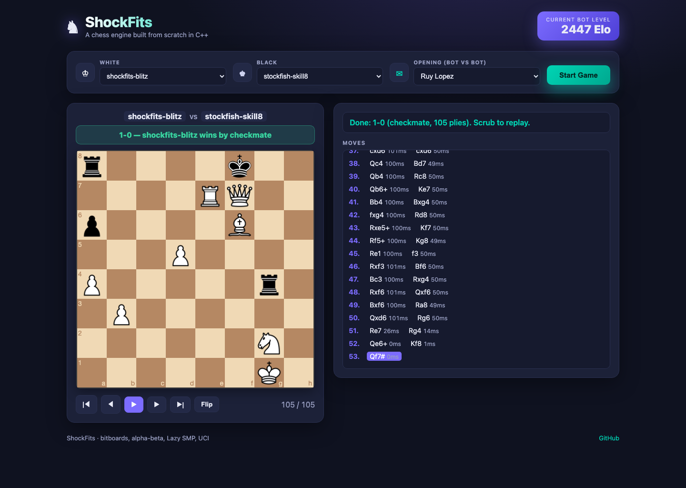

# ShockFits

### Current bot level: ~2450 Elo

*(performance rating for `shockfits-blitz` at 100 ms/move, measured vs Stockfish
with calibrated `UCI_Elo` — see [Measuring strength](#measuring-strength-elo).)*



*The browser arena: watch bots fight live (with per-move think times), then scrub
the replay. Above, `shockfits-blitz` mates `stockfish-skill8`.*

A chess engine built **from scratch in C++** — bitboards, alpha-beta search,
a lock-free transposition table, Lazy-SMP multithreading, and the UCI protocol —
with a browser **arena** to play it, watch bots fight live, and pit it against
Stockfish across thousands of games.

Inspired by Sebastian Lague's
[Chess-Coding-Adventure](https://github.com/SebLague/Chess-Coding-Adventure).

---

## What's inside

**Engine (C++20, `core/`)**
- **Bitboard** board representation (LERF), fully legal move generation
  (**perft-verified** on startpos, Kiwipete, and positions 3/4/5)
- **Negamax + alpha-beta**, iterative deepening, quiescence, check extensions
- Move ordering: TT move, MVV-LVA, killer moves, history heuristic
- **Tapered PeSTO evaluation** (midgame/endgame interpolation)
- **Zobrist hashing** + **lock-free transposition table** (Hyatt XOR scheme)
- **Lazy-SMP multithreading** (opt-in, hard-capped to the machine's cores)
- Full **UCI** implementation — plugs into any GUI or `cutechess`-style tooling

**Arena (Python + web, `tools/` + `web/`)**
- Bot **registry**: versioned fighters (engine + UCI options + search limit)
- **Match runner / tournaments**: Bots Royale (round-robin, crosstable, Elo) and
  a Stockfish Gauntlet (Elo + SPRT), driven by `python-chess` as referee
- **Elo calibration** ladder vs Stockfish `UCI_Elo`
- **Browser arena**: pick White & Black (Human or any bot / Stockfish level),
  play interactively, or watch bot-vs-bot **live** and scrub the replay — with
  per-move think times

---

## Quick start

### Build the engine
```bash
cmake -S . -B build -DCMAKE_BUILD_TYPE=Release
cmake --build build -j          # emits core/engine
ctest --test-dir build          # perft + search + uci tests
```

### Set up the arena tooling
```bash
uv venv
uv pip install -r tools/requirements.txt \
  --index-url https://pypi.ci.artifacts.walmart.com/artifactory/api/pypi/external-pypi/simple \
  --allow-insecure-host pypi.ci.artifacts.walmart.com
brew install stockfish          # opponent for gauntlet/calibration
```

### Play in the browser
```bash
cd web && npm install && npm start   # http://localhost:3000
```

---

## Arena CLI

```bash
# round-robin among registered bots
.venv/bin/python -m tools.arena.cli royale --games 6

# a bot vs Stockfish (Elo + SPRT verdict)
.venv/bin/python -m tools.arena.cli gauntlet shockfits-blitz --games 20

# measure a bot's Elo vs calibrated Stockfish
.venv/bin/python -m tools.arena.calibrate --bot shockfits-blitz --games 12 --movetime 100
```

---

## Measuring strength (Elo)

`tools.arena.calibrate` plays the bot against Stockfish at several
`UCI_LimitStrength` / `UCI_Elo` "rungs" (both sides on the same movetime, so the
number means *strength at that time control*). Each rung yields a score rate; the
headline is a games-weighted **performance rating**.

Latest run — `shockfits-blitz` @ 100 ms/move (6 games/rung):

| Stockfish `UCI_Elo` | Score | Perf |
|---:|---:|---:|
| 1800 | 67% | 1920 |
| 2100 | 58% | 2158 |
| 2400 | 75% | 2591 |
| 2700 | 58% | 2758 |
| 3000 | 25% | 2809 |

**Performance estimate: ~2447 Elo** (50% crossover ≈ 2775).

> Caveats: small samples (6 games/rung, so ±100+ Elo noise), fast time control,
> and Stockfish's `UCI_Elo` is itself an approximation. Treat this as a ballpark
> "it plays around 2400-2500 blitz strength," not a rating-list number. Re-run
> with more games for tighter bounds.

---

## Repo layout
```
core/    C++ engine (include/, src/, tests/) + CMake
tools/   Python arena: bot registry, match runner, tournaments, calibration
bots/    committed bot manifests (the roster)
web/     browser arena (Node/Express + chessboard.js)
PLAN.md  phase-by-phase development log
```

## References
- [Chess Programming Wiki](https://www.chessprogramming.org/)
- Sebastian Lague — Chess-Coding-Adventure
